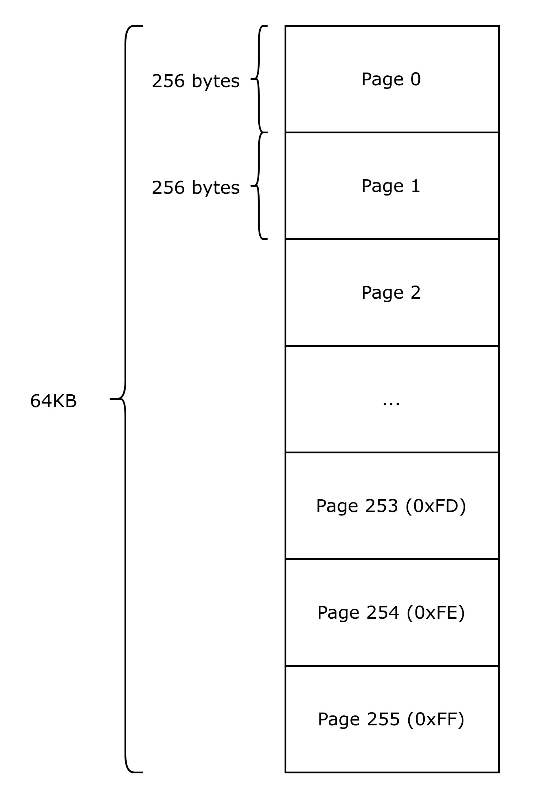
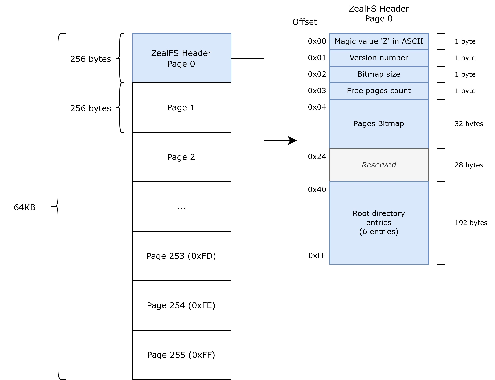
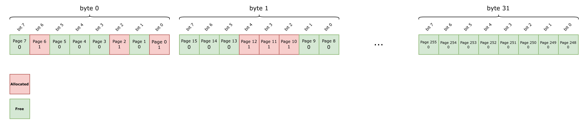
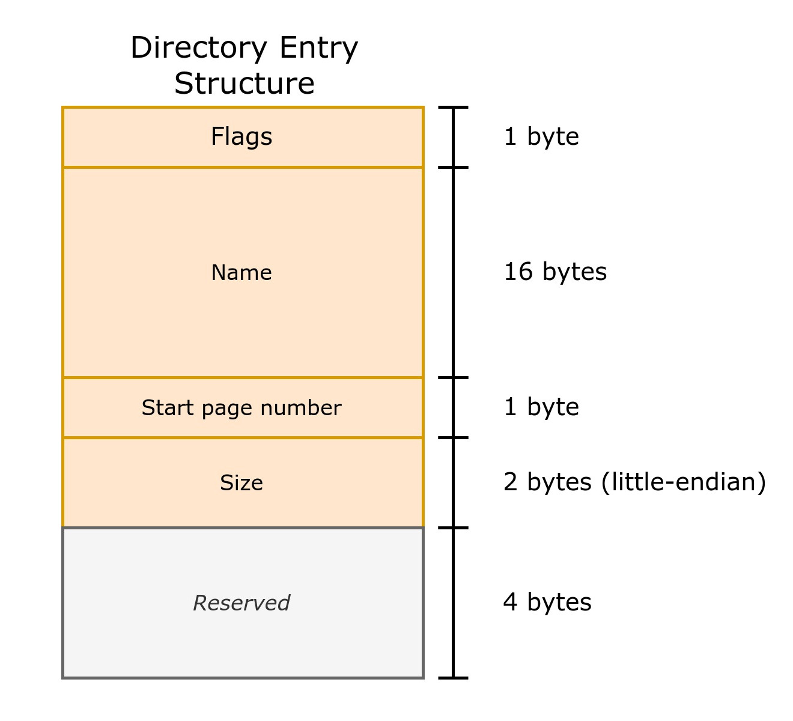
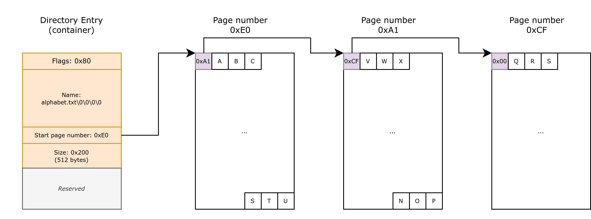

<p align="center">
    
</p>
<p align="center">
    <a href="https://opensource.org/licenses/Apache-2.0">
        
    </a>
    <p align="center">A file system made for small storage and implementable on 8-bit computers!</p>
</p>

## Yet another file system?

If you follow my work, you may be aware that I am developing a Z80-based 8-bit computer entirely from scratch: from PCB to software. It integrates an I2C EEPROM socket that can accommodate any compatible chip, usually ranging from 2KB to 128KB. As such, they are smaller than floppy disks or other flash memories. Moreover, the operating system running on it, Zeal 8-bit OS, is based around disks, files and directories, I was looking for a file system with a low storage overhead and simple enough to be implemented in Z80 assembly.

That excluded all FAT12, FAT16, as well as other modern alternatives (FAT32, exFAT, NTFS, Ext2/3/4, etc...)

Other custom smaller FAT alternatives I could find online had their own limitations, such as the absence of directories.

This is why ZealFS is here!

## Features

Here is a non-exhaustive list of the current features:
* Features files and directories, no limit in depth.
* Total storage size up to 64KB.
* Names up to 16 characters.
* Date in BCD format.
* The only limit of file size is the storage itself.
* Small overhead thanks to 256-byte pages, making the smallest entity, dir or file, 256 bytes big.
* Up to 8 entries per directory*.
* Room for future extensions.
* Concise implementation: around 1.3KB in Z80 assembly (Zeal 8-bit OS), less than 1000 lines of C using FUSE.

*: Limited to 6 for the root directory.

## Compilation and usage

This repository contains an implementation of ZealFS for Linux, in the form of a FUSE implementation. [More info about FUSE on their project page](https://github.com/libfuse/libfuse). It was tested on Ubuntu 22.04 LTS.

### Dependencies

In order to use the example you will need:
* make
* libfuse3-dev
* gcc (or any other compatible C compiler)


For example, on Ubuntu, you can install the main dependencies with:
```
sudo apt install libfuse3-dev make
```

### Compilation

To compile the project, type:
```
make
```

Upon success, a new binary is created named `zealfs` by default.

### Usage

In order to use the file system, you will need a disk image and a mount point. If you don't have any, no worries, the binary will create one. By default, the program will name it `zfs.img` and give it a size of 32KB. You can override these parameters, with options `--image` and `--size` respectively. For example, you can use:

```
./zealfs --image=my_disk.img --size=64 my_mount_dir
```

This will create a new disk image named `my_disk.img` of size 64KB and mounted in the directory `my_mount_dir` present in the current folder. The binary should show:
```
$ mkdir my_mount_dir
$ ./zealfs --image=my_disk.img --size=64 my_mount_dir
Info: using disk image my_disk.img
$
```
The binary is then running in background, the content of the disk image can be populated or checked either through the terminal or with a GUI file explorer, just like regular file systems.


You can get all the possible parameters by using command:
```
./zealfs --help
```

### Unmounting the disk image

After using the disk image, you must unmount it thanks to the command:
```
umount my_mount_dir
```

**Unmounting is very important, as it will flush all the data written to the virtual disk into the actual image file!**

## Implementation details

### Pages

The file system is based around virtual pages. No matter how big the storage is, it will be virtually split into 256-byte pages. As such, a memory of size N KB will have `N*1024/256` virtual pages.

A page is always designated by its index, which is also called "number" in the code. So page index/number 0 designates the page that starts at address `0x0000`, page 1 designates the one starting at address `0x0100`, etc...
We can also say that the page number/index represents the upper 8-bit of the page address in the storage.

Pages are the smallest entities in the file system that can be allocated and freed. Thus, the smallest entities (files) are 256-byte big.


The following diagram shows an example of the virtual pages on a 64KB disk:


### Header

The first page of the file system is reserved and **always** allocated: it's the header.

It contains the following information:
* Magic byte, `Z` in ASCII (`0x5A`)
* Implementation revision/version
* Bitmap size
* Number of free pages in the disk
* Bitmap of allocated pages, always 32 bytes. (more about this below)
* *Reserved area* (28 bytes)
* Entries of the root directory

The first value, magic byte is used to recognize easily if the file is a ZealFS disk image or not.

The second byte, represents the version of ZealFS the current image/disk is implementing.

The third field, as is name states, represents the size of the bitmap in **bytes**.

The fourth field represents the number of free pages in the disks, this value may be redundant with the bitmap, but keep in mind that this file system was designed with 8-bit implementation in mind, so it is easier and faster to check this value than browsing the whole bitmap.

The fifth field is the bitmap of allocated pages, always 32 bytes, even on memories smaller than 64KB. The bitmap is aligned on 32-bit, which makes it possible for a (little-endian) host computers to cast this array into a 32-bit one, for faster allocate and free operations.

The following bytes are currently unused but reserved for future use. They also serve as a padding for the next entry.

Finally, with the remaining space in the page, we can store file entries. These entries represent the root directory. Thus, the maximum number of entries we can have in the root directory is `256 - sizeof(header) / sizeof(entry) = 6`. This field is aligned on `sizeof(entry) = 32` bytes.


This diagram shows the organization of header, which is located in the first page, page 0:


### Bitmap

The most important field of the header is the bitmap. Its role is to mark which 256-byte pages in the disk are free and which ones are allocated. Each bit represents a page, a `1` means allocated, a `0` means free.

As we have at most 256 pages on the disk, the bitmap size is `256/8 = 32` bytes. Bit `n` of byte `m` represents the page number `m * 8 + n`. Symmetrically, if we have a page number `p`, we can calculate its location in the bitmap, `m = p / 8` and `n = p % 8`.

For example, the page starting at disk offset `0x9A00` is page number `0x98`, it is represented by bit `0x9a % 8 = 2` of byte `0x9a / 8 = 19` in the bitmap.

In C, we can get its value with:
```C
const uint8_t byte = 0x9a / 8;
const uint8_t bit  = 0x9a % 8;
const uint8_t page_status = header->bitmap[byte] & (1 << bit);
```

The following **must** be true at all time:
* The number of 0 bits, marking a free page, in the whole bitmap is equal to the `free_pages` field from the header.
* The first bit of the bitmap (bit 0, byte 0) is 1, as page 0 is always allocated, it contains the file system header.

The following diagram is an example of a bitmap:


In this example, the allocated pages are in red (bit is 1), and free pages are in green. (bit is 0)

### Directory and entry structure

All the directories in the file system have the same structure, they are composed of several entries: 6 for the root directory, 8 for other.

Each entry is 32-byte long and composed of:
* One byte of flags
* Name of the file/directory, 16-char long
* Page number where the content starts
* 16-bit size of the file, or `0x100` is case of a directory. The value is stored in little-endian.
* Date of creation. The date format is the same as in [Zeal 8-bit OS](https://github.com/Zeal8bit/Zeal-8-bit-OS/blob/main/include/time_h.asm), which is using BCD encoding.
* Reserved bytes, used for padding, and future extensions.

The following diagram shows the structure of the entries:


Currently, the flag field is composed as followed:
* Bit 7: 1 if the entry is occupied, 0 if the entry is free
* *Bit 6..1: reserved/unused*
* Bit 0: 1 if the entry is a directory, 0 if the entry is a file

The name is 16-char long, it shall only contains ASCII printable characters, excluding `/` character. Lowercase and uppercase are both valid and are **not** equivalent. It can contain an extension, but in that case, the `.` is also part of the 16 characters. If the name of the entry is less than 16 characters, 0 bytes must be used as padding.

The page number marks the page containing the beginning of the content. If the entry is a directory, that start page itself contains again 8 entries. Thus, there is no limit in depth in the file system.
If the entry is a file, the start page contains the content as described in the next section.

### File content

The previous section describes how the directories are structured. The files' metadata are all contained in the entry structure, thus, they are part of the directory that contains the file.

The files are composed of one of several page, which can be seen as a linked-list. Again, each page is 256 bytes, the first byte contains another page number, the remaining 255 bytes represent the file content.

That other page number points to the page that contains the remaining bytes of the file. If there are no other page, this byte **must** be 0. Of course, the page that is pointed by this number must also be a file page and not a directory page.

To calculate the amount of page a file requires, we need to calculate: `(file_size + 254) / 255`, in other words, we divide the file size by 255 and we round up the result. For example, a file containing 512 bytes will need 3 pages.
Let's imagine this file is named `alphabet.txt` contains the pattern "ABC...XYZABC...XYZ...", its structure would look like this:



## License
Distributed under the Apache 2.0 License. See LICENSE file for more information.

You are free to use it for personal and commercial use, the boilerplate present in each file must not be removed.

## Contact

For any suggestion or request, you can contact me at contact [at] zeal8bit [dot] com

For bug fixes, or questions, you can also open a pull request or an issue.